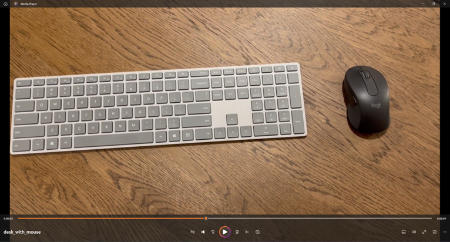

# Object Detection and Extraction Documentation

The object detection application has successfully identified and extracted an object from the original image. Below are the original image and the extracted object:

## Original Image (from a video)



## Extracted Object

The object detection model has isolated the following object from the original image:


## Process Overview

1. The object detection model was applied to the original image.
2. The model identified a mouse as a distinct object within the image.
3. Using the model's output, the mouse was extracted from the original image.
4. The extracted object was saved as a separate image file.

This demonstrates the capability of the object detection application to identify and extract items from a complex background, which can be particularly useful in various computer vision tasks such as inventory management, automated checkout systems, or even for preparing datasets for further machine learning tasks.

# Dockerized Application Setup and Execution Guide (risk_manager)

This guide outlines the steps to build and run a Dockerized application using `docker-compose`, including specifying the requirements for Python and Docker. Following these instructions will enable access to the application via `http://localhost:8000/`.

## Prerequisites

Before you begin, ensure you have the following installed on your system:

- **Docker**: An open platform for developing, shipping, and running applications. Docker enables you to separate your applications from your infrastructure so you can deliver software quickly. [Download Docker](https://www.docker.com/products/docker-desktop)
- **Docker Compose**: A tool for defining and running multi-container Docker applications. With Compose, you use a YAML file to configure your application's services. It then creates and starts all the services from your configuration. Docker Compose is included with Docker Desktop.

## Python Requirements

Your Dockerized application will run in an isolated container, including all necessary Python packages specified in `requirements.txt` file. Ensure this file is up to date with all the dependencies your Python application needs.

## Setting Up and Running the Application

1. **Navigate to the Project Directory**

   Open a terminal and change to your project directory where `docker-compose.yml` is located.

   ```bash
   cd path/to/computer-vision/risk_manager
   ```

2. **Build and Start Your Application**

   Use `docker-compose` to build and start your application. The `--build` option ensures that Docker builds fresh images, considering any changes made to the Dockerfile or to your application's dependencies specified in `requirements.txt`.

   ```bash
   docker-compose up --build
   ```

   This command starts the containers defined in your `docker-compose.yml` file. If you're running the command for the first time, it might take some time to download the required Docker images and build your application's image.

3. **Accessing the Application**

   Once the application is running, you can access it by navigating to [http://localhost:8000/](http://localhost:8000/) in your web browser.

   This assumes your `docker-compose.yml` or Dockerfile configures the application to listen on port 8000 and maps this port to the host.

4. **Shutting Down the Application**

   To stop and remove the containers, networks, and volumes created by `docker-compose up`, use the following command in the terminal:

   ```bash
   docker-compose down
   ```

## :warning: Important Note

Ensure your Dockerfile correctly sets up the Python environment, installs dependencies from `requirements.txt`, and starts your application. This setup is crucial for the application to run successfully in a Docker container and be accessible on `http://localhost:8000/`.

If you encounter any issues with Docker or Docker Compose, consult the official documentation for troubleshooting and detailed usage instructions:

- [Docker Documentation](https://docs.docker.com/)
- [Docker Compose Documentation](https://docs.docker.com/compose/)

# Project Setup and Execution Guide on Virtual Environment (object_detection)

This guide covers setting up a virtual environment, installing dependencies, and running the `predict.py` script within the `object_detection` project. Separate instructions are provided for Windows and Unix-like operating systems (macOS and Linux).

## Windows

Follow these steps to set up and run the project on Windows:

1. **Navigate to the Project Directory**

   Open Command Prompt and change to the project directory:

   ```cmd
   cd path\to\computer-vision\object_detection
   ```

2. **Create a Virtual Environment**

   Run the following command to create a virtual environment named `computer_vision`:

   ```cmd
   python -m venv computer_vision
   ```

3. **Activate the Virtual Environment**

   Activate the virtual environment by running:

   ```cmd
   computer_vision\Scripts\activate
   ```

4. **Install Dependencies**

   Install the required Python packages from `requirements.txt`:

   ```cmd
   pip install -r requirements.txt
   ```

5. **Run the Prediction Script**

   Execute `predict.py`, which is located in the `src` directory:

   ```cmd
   python src\predict.py
   ```

Press key Q to stop.

6. **Deactivate the Virtual Environment**

   Once you're done, you can deactivate the virtual environment:

   ```cmd
   deactivate
   ```

## macOS and Linux

For macOS and Linux systems, follow these instructions:

1. **Navigate to the Project Directory**

   Open a terminal and change to the project directory:

   ```bash
   cd path/to/computer-vision/object_detection
   ```

2. **Create a Virtual Environment**

   Create a virtual environment named `computer_vision`:

   ```bash
   python -m venv computer_vision
   ```

3. **Activate the Virtual Environment**

   Activate the virtual environment:

   ```bash
   source computer_vision/bin/activate
   ```

4. **Install Dependencies**

   Install the required Python packages:

   ```bash
   pip install -r requirements.txt
   ```

5. **Run the Prediction Script**

   Run `predict.py` located in the `src` directory:

   ```bash
   python src/predict.py
   ```

Press key Q to stop.

6. **Deactivate the Virtual Environment**

   Deactivate the virtual environment:

   ```bash
   deactivate
   ```

## :warning: Important Note Regarding Webcam Initialization

When running `predict.py`, the script may attempt to access your computer's webcam for object detection tasks. Ensure that your webcam is properly connected and configured to be accessible by Python scripts. On some systems, you may need to grant permission for webcam access. If the script fails to initialize the webcam, check your system's privacy settings and the script's webcam access code.
